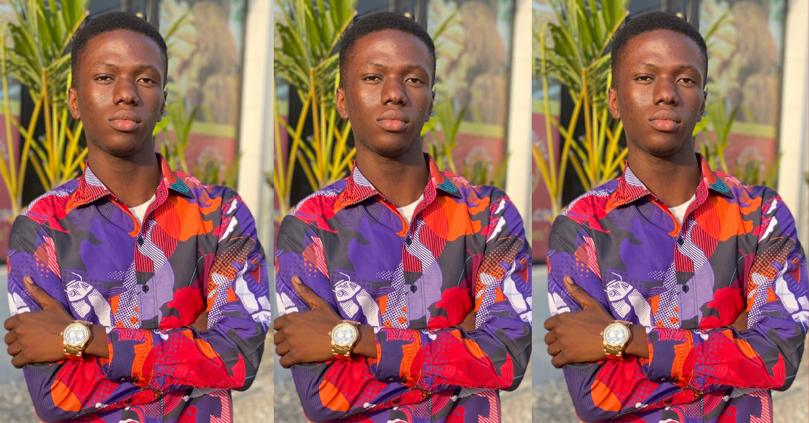

# Omosuyi Olawole - Portfolio

<div align="center">



**A modern, responsive portfolio showcasing my work as a Full-Stack Software Engineer**

[](https://nextjs.org/)
[](https://www.typescriptlang.org/)
[](https://tailwindcss.com/)
[](https://reactjs.org/)

[Live Demo](https://omooladev-portfolio.onrender.com/) • [GitHub](https://github.com/omooladev/omooladev-portfolio)

</div>

---

## 👨‍💻 About Me

I'm **Omosuyi Olawole** (also known as **omooladev**), a dedicated Full-Stack Software Engineer from Lagos, Nigeria, specializing in web application development. My core expertise lies in JavaScript, and I'm passionate about building exceptional user experiences through code.

- 🎓 Civil Engineering graduate from Federal University of Technology
- 💻 Focused on continuous learning and exploring new technologies
- 🔧 Currently mastering Node.js, TypeScript, and Webpack
- 🌍 Open to new opportunities and collaborations

---

## ✨ Features

### 🎨 Modern Design
- ✅ Clean, minimalist interface with smooth animations
- ✅ Dark/Light theme toggle with persistent preference
- ✅ Fully responsive design (mobile, tablet, desktop)
- ✅ Custom scrollbar and scroll animations

### 🚀 Project Showcase
- ✅ Interactive project cards with live website preview on hover
- ✅ Detailed project pages with features and technologies
- ✅ Live iframe previews of deployed projects
- ✅ GitHub and live demo links for each project

### 📱 Navigation
- ✅ Smooth scroll-to-section navigation
- ✅ Mobile-friendly hamburger menu
- ✅ Dynamic routing between pages
- ✅ Breadcrumb navigation on project details

### 💼 Professional Sections
- ✅ Hero section with introduction
- ✅ About me with profile image
- ✅ Projects portfolio
- ✅ Work experience timeline
- ✅ Contact information with social links

---

## 🛠️ Tech Stack

### Frontend
- **Framework:** [Next.js 15.5.6](https://nextjs.org/) (App Router)
- **Language:** [TypeScript 5.x](https://www.typescriptlang.org/)
- **UI Library:** [React 19.0](https://react.dev/)
- **Styling:** [Tailwind CSS 3.4.1](https://tailwindcss.com/)
- **Animations:** [Framer Motion 11.15.0](https://www.framer.com/motion/)
- **Icons:** [Boxicons](https://boxicons.com/) & [Font Awesome](https://fontawesome.com/)
- **Font:** [Poppins (Google Fonts)](https://fonts.google.com/specimen/Poppins)

### Development Tools
- **Package Manager:** npm
- **Linting:** TypeScript ESLint
- **CSS Processing:** PostCSS with Autoprefixer
- **Image Optimization:** Next.js Image Component

### Deployment
- **Platform:** Render / Vercel
- **Build:** Static Site Generation (SSG)
- **Performance:** Optimized with Next.js turbopack

---

## 📂 Project Structure

```
omooladev-portfolio/
├── app/                          # Next.js App Router
│   ├── components/               # React components
│   │   ├── Header.tsx           # Navigation header with theme toggle
│   │   ├── Footer.tsx           # Footer with social links
│   │   ├── ProjectCard.tsx      # Project card with hover preview
│   │   └── ThemeProvider.tsx    # Dark/Light theme context
│   ├── projects/                # Projects routes
│   │   ├── page.tsx            # All projects listing
│   │   └── [slug]/             # Dynamic project details
│   │       └── page.tsx        # Individual project page
│   ├── layout.tsx              # Root layout with metadata
│   ├── page.tsx                # Home page
│   └── globals.css             # Global styles with Tailwind
├── data/                        # TypeScript data files
│   ├── projects.ts             # Projects data with interfaces
│   └── experience.ts           # Work experience data
├── public/                      # Static assets
│   ├── images/                 # Images and photos
│   ├── icons/                  # Technology icons
│   ├── pdfs/                   # Resume and documents
│   └── project-images/         # Project thumbnails
├── next.config.ts              # Next.js configuration
├── tailwind.config.ts          # Tailwind CSS configuration
├── tsconfig.json               # TypeScript configuration
└── package.json                # Dependencies and scripts
```

---

## 🚀 Getting Started

### Prerequisites

- Node.js 18.x or higher
- npm or yarn

### Installation

1. **Clone the repository**
   ```bash
   git clone https://github.com/omooladev/omooladev-portfolio.git
   cd omooladev-portfolio
   ```

2. **Install dependencies**
   ```bash
   npm install
   ```

3. **Run development server**
   ```bash
   npm run dev
   ```

4. **Open in browser**
   ```
   http://localhost:3000
   ```

### Build for Production

```bash
npm run build
npm start
```

---

## 📱 Responsive Breakpoints

The portfolio is fully responsive across all devices:

| Breakpoint | Width | Description |
|-----------|-------|-------------|
| Mobile | < 640px | Single column, hamburger menu |
| Small Tablet | 640px - 767px | Optimized for small tablets |
| Tablet | 768px - 1023px | 2-column layouts |
| Desktop | 1024px - 1279px | 3-column layouts, full nav |
| Large Desktop | 1280px+ | Maximum width with optimal spacing |

---

## 🎯 Key Features Implementation

### 1. **Project Hover Effect**
When you hover over a project card, an iframe displays a live preview of the actual deployed website, giving visitors a real-time glimpse of the project.

```typescript
// ProjectCard.tsx
{isHovered && project.websitePreview && (
  <iframe
    src={project.websitePreview}
    className="w-full h-[200%] scale-50..."
  />
)}
```

### 2. **Theme Toggle**
Dark and light mode with persistent storage:
```typescript
// ThemeProvider.tsx
const savedTheme = localStorage.getItem("theme");
document.documentElement.classList.toggle("dark", theme === "dark");
```

### 3. **Smooth Scroll Navigation**
Intelligent scroll-to-section that works across pages:
```typescript
// Header.tsx
const handleNavClick = (sectionId: string) => {
  if (pathname !== "/") {
    window.location.href = `/#${sectionId}`;
  } else {
    element.scrollIntoView({ behavior: "smooth" });
  }
};
```

---

## 📊 Featured Projects

### 1. FlowNews
An interactive news platform with user contribution features.
- **Tech:** React, Node.js, Express, MongoDB
- **Live:** [flownews.netlify.app](https://flownews.netlify.app)

### 2. ShopCommerce
Full-featured e-commerce platform with admin dashboard.
- **Tech:** TypeScript, Node.js, MongoDB, Cloudinary
- **Live:** [shopcommerce.onrender.com](https://shopcommerce.onrender.com)

### 3. Cropify
Browser-based image cropping tool with professional features.
- **Tech:** JavaScript, Webpack, Cropper.js
- **Live:** [cropify.vercel.app](https://cropify.vercel.app/)

---

## 🔧 Scripts

| Command | Description |
|---------|-------------|
| `npm run dev` | Start development server with hot reload |
| `npm run build` | Build production-ready application |
| `npm start` | Start production server |
| `npm run lint` | Run TypeScript and ESLint checks |

---

## 🌐 Deployment

This portfolio is optimized for deployment on:

- **Vercel** (Recommended for Next.js)
- **Render**
- **Netlify**
- **Any platform supporting Node.js**

### Deploy to Vercel

```bash
npm install -g vercel
vercel
```

---

## 📞 Contact & Social

- **Email:** [omooladev@gmail.com](mailto:omooladev@gmail.com)
- **LinkedIn:** [linkedin.com/in/omosuyiolawole](https://www.linkedin.com/in/omosuyiolawole)
- **GitHub:** [github.com/omooladev](https://github.com/omooladev)
- **Twitter/X:** [@omooladev](https://x.com/omooladev)

---

## 📄 License

This project is open source and available under the [MIT License](LICENSE).

---

## 🙏 Acknowledgments

- **Next.js Team** for the amazing framework
- **Vercel** for excellent deployment platform
- **Tailwind CSS** for the utility-first CSS framework
- **Font Awesome & Boxicons** for beautiful icons

---

## 📈 Updates & Changelog

### Latest Update
**Last Modified:** November 23, 2025
**Commit:** [9157c2d](https://github.com/omooladev/omooladev-portfolio/commit/9157c2d) - Migrate portfolio to Next.js 15 with Tailwind CSS

#### Major Changes:
- ✅ Migrated from vanilla HTML/CSS/JS to Next.js 15
- ✅ Implemented TypeScript for type safety
- ✅ Added Tailwind CSS for responsive design
- ✅ Created dynamic routing for projects
- ✅ Added dark/light theme toggle
- ✅ Implemented project hover preview feature
- ✅ Built comprehensive project details pages
- ✅ Added work experience section
- ✅ Made entire application mobile responsive

---

<div align="center">

**Built with ❤️ by Omosuyi Olawole**

⭐ Star this repo if you find it useful!

</div>
